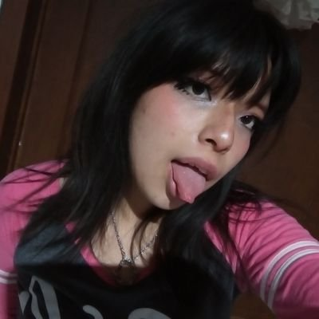
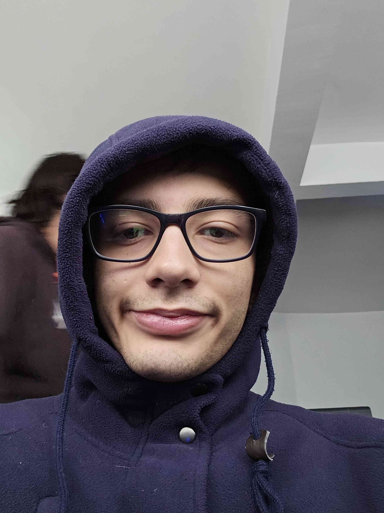
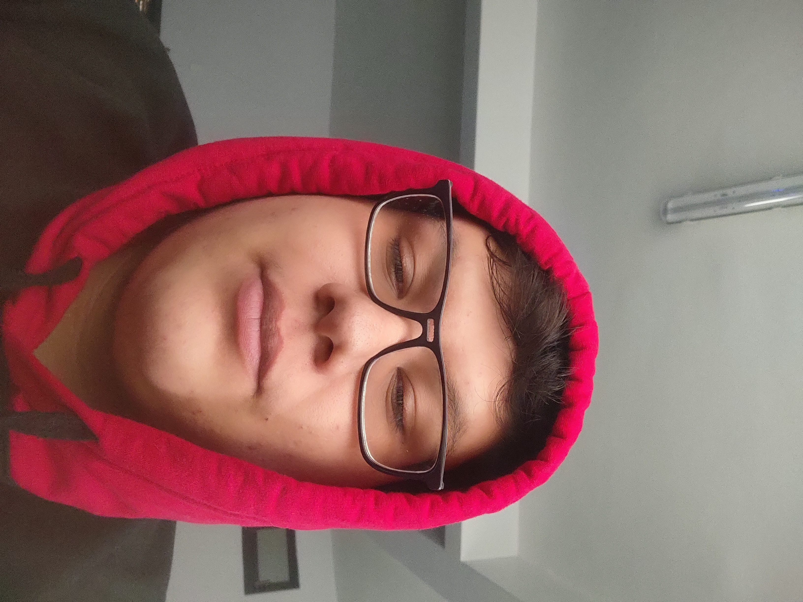
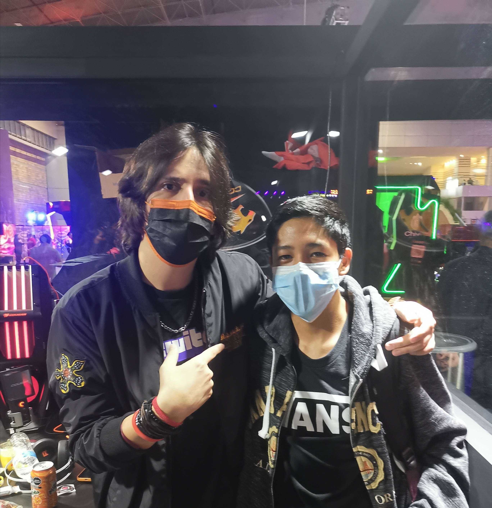
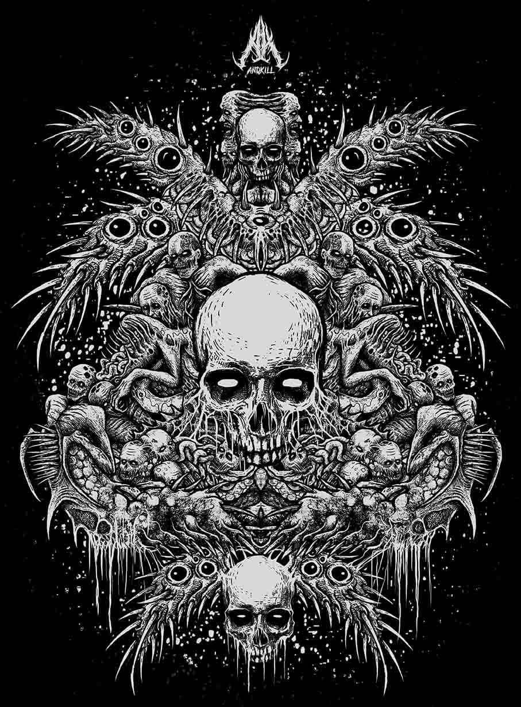

# Programación en Lenguajes Interpretados

Esta es la lista de integrantes de la materia **Programación con Lenguajes Interpretados** de _**\@3DEV**_ de _**Amerike**_.

## Profesor

### Jonathan MirCha

Hola soy tu amigo y docente digital.

- [jmiranda@amerike.edu.mx](jmiranda@amerike.edu.mx)
- [_GitHub/jonmircha_](https://github.com/jonmircha)

---

## Estudiantes

### Grecia Lorena Morales Castillo

Estudiante del Instituto Universitario Amerike en la carrera de Desarrollo de Software Interactivo y Videojuegos. Actualmente con la edad de 20 años. Mis juegos favoritos son Fable y Halo :3

- [cdmx2510@amerike.edu.mx](cdmx2510@amerike.edu.mx)
- [_GitHub/Greyslor_](github.com/Greyslor)

---

### Víctor Javier Chavarría Martínez

18 años, actor, coreografo, bailarin, estudiante de programación y canto, atleta, Smash && BS ProPL, y GYM rat.

- [Email](cdmx2372@amerike.edu.mx)
- [Git](https://github.com/VictorJ-Ch)

### Fernando Horta Peña

Soy el pelirrojo de Amerike

- [cdmx2458@amerike.edu.mx](cdmx2458@amerike.edu.mx)
- [GitHub/KurenaiOuji](https://github.com/KurenaiOuji)

---

### Shika Moriyama

Soy Shika :)

El gaming es lo de hoy

- [cdmx2397@amerike.edu.mx](cdmx2397@amerike.edu.mx)
- [_GitHub/shikatastrophe_](https://github.com/Shikatastrophe)

---

### Wilbert Arcila 

soy wilbert tengo 20 años y estoy estudiando la carrera de desarrollo de software interactivo en Amerike

- [cdmx2301@amerike.edu.mx](cdmx2301@amerike.edu.mx)
- [_GitHub/warcilac9](https://github.com/warcilac9)

---

### Jonathan Zavala

me gusta jugar videojuegos y ver anime 

- [cdmx2506@amerike.edu.mx](cdmx2506@amerike.edu.mx)
- [_GitHub/Zniver4_](https://github.com/Zniver4)

---

### Carol Torres

Juego overwatch

- [cdmx2419@amerike.edu.mx](cdmx2419@amerike.edu.mx)
- [GitHub/Ikkilink](https://github.com/Ikkilink)

---

### Samuel Gutierrez

tengo 19 años y estudio en amerike

- [cdmx2547Qamerike.edu.mx](cdmx2547Qamerike.edu.mx)
- [_GitHub/SamGtzs](https://github.com/SamGtzs)

---

### Jose Andres Rodriguez Chirino

Qiubo, soy vicio, tu disonancia cognitivca favorita.

- [cdmx2418@amerike.edu.mx](cdmx2418@amerike.edu.mx)
- [_GitHub/jonmircha_](https://github.com/Sholensk)

---

### Victor Andre Sanchez Garcia

Uno de los 3 cabroncitos 

- [cdmx2339@amerike.edu.mx](cdmx2339@amerike.edu.mx)
- [https://github.com/Victor-Sanchez-3010](https://github.com/Victor-Sanchez-3010)

---

### Andre Eduardo Cerdan Abarca

Uno de los 3 cabroncitos

- [tucorreo@amerike.edu.mx](cdmx2528@amerike.edu.mx)
- [Tu perfil de _GitHub_](https://github.com/megaandre)

---
