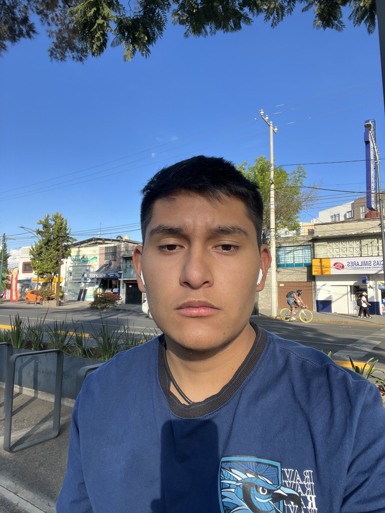

# Programación en Lenguajes Interpretados

Esta es la lista de integrantes de la materia **Programación con Lenguajes Interpretados** de _**\@3DEV**_ de _**Amerike**_.

## Profesor

### Jonathan MirCha

Hola soy tu amigo y docente digital.

- [jmiranda@amerike.edu.mx](jmiranda@amerike.edu.mx)
- [_GitHub/jonmircha_](https://github.com/jonmircha)

---

## Estudiantes

### Fernando Horta Peña

Soy el pelirrojo de Amerike

- [cdmx2458@amerike.edu.mx](cdmx2458@amerike.edu.mx)
- [GitHub/KurenaiOuji](https://github.com/KurenaiOuji)

### Victor Andre Sanchez Garcia

Uno de los 3 cabroncitos 

- [cdmx2339@amerike.edu.mx](cdmx2339@amerike.edu.mx)
- [https://github.com/Victor-Sanchez-3010](https://github.com/Victor-Sanchez-3010)

---